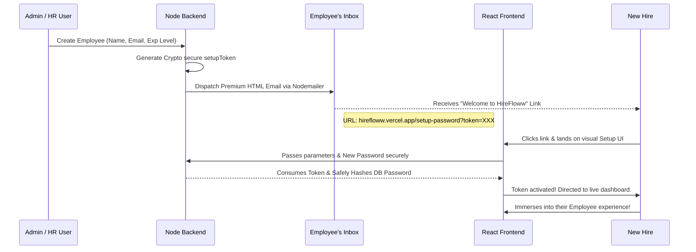

# 🚀 HireFloww: Next-Gen HR Onboarding Portal

[](https://hirefloww.vercel.app)
[](https://hr-onboarding-portal.onrender.com)

Welcome to **HireFloww**, the premium, state-of-the-art Human Resources Onboarding Portal designed to seamlessly transition new hires from "offer" to "office." Built entirely on the MERN stack (MongoDB, Express, React, Node.js), this platform offers completely automated email integrations, real-time socket communications, beautiful modern UI with glassmorphism, and seamless dual-theme (Light/Dark) support.

## 🌟 Key Features

### 1. 🔐 Role-Based Access Control (RBAC)
- **Super Admin**: Complete system overview. Can unilaterally provision/delete HR members and execute global user management.
- **HR User**: Generate new Employee invitations securely. Monitor live onboarding task completion percentages, review Cloudinary document proofs dynamically, and send instant chat reminders.
- **Employee User**: An immersive, guided portal to complete onboarding steps precisely matched to their "fresher" or "experienced" status.

### 2. ⚡ Real-Time Socket Communications & Toast Logic
- **Live Chat Rooms**: Employees and HR can natively message one another continuously with no page reloading. 
- **Smart Toast Notifications**: With integrated `react-hot-toast`, if HR is navigating the platform and receives an incoming employee message, a sleek slide-in notification alerts them instantly. 

### 3. 📧 Automated Email Provisioning Flow
Instead of insecurely handing out static plain-text passwords, HireFloww natively deploys automated **Nodemailer** invitations! Upon entering a user's details, the backend generates an encrypted initialization token. When the employee clicks the email, they arrive at a flawless React route (`/setup-password`) to initialize their own secure credentials natively.

---

## 🗺️ Visual Architecture & Onboarding Flow



---

## 📁 Feature-Sliced Project Structure

To guarantee scalability and enterprise production-readiness, the entire codebase has been restructured into the robust **Feature-Sliced Design** (`/features`, `/shared`, and `/core`).

```text
HR-onboarding-portal/
├── backend/
│   ├── src/
│   │   ├── core/                  # Global Middlewares, Services & Utilities
│   │   │   ├── middlewares/       # Auth, Upload, Error Handlers
│   │   │   ├── models/            # Shared Data Schemas (Notifications, Docs)
│   │   │   ├── services/          # Cloudinary & Socket.io Handlers
│   │   │   └── utils/             # Nodemailer integrations
│   │   │
│   │   ├── features/              # Modularized Business Logic
│   │   │   ├── admin/             # Admin Controllers & Routes
│   │   │   ├── auth/              # JWT Login & Setup-Password flows
│   │   │   ├── chat/              # Realtime Messages schema & routing
│   │   │   ├── employee/          # Employee documents logic
│   │   │   ├── hr/                # HR analytics & overview controllers
│   │   │   └── user/              # Base Account Schema
│   │   │
│   │   ├── app.js                 # Express App Initialization
│   │   └── server.js              # HTTP & Socket Engine Boot
│   └── .env                       # Environment Variables
│
└── frontend/
    ├── src/
    │   ├── features/              # Feature-Driven UI Modularity
    │   │   ├── admin/             # SuperAdmin Dashboard Pages
    │   │   ├── auth/              # Secure Authentication UIs
    │   │   ├── chat/              # Dedicated Live Chat Pages
    │   │   ├── employee/          # Guided Employee Experience UIs
    │   │   └── hr/                # HR Tracking Dashboards
    │   │
    │   └── shared/                # Globally Reusable Assets
    │       ├── components/        # Navbars, Footers, Graphs & Layouts
    │       ├── context/           # React Theme & Auth Providers
    │       └── services/          # Base Axios API instances
    │
    ├── index.css                  # Core Tailwind Styles & Glassmorphism
    └── vite.config.js             # Vite Compilation Engine
```

---

## 🛠️ Technology Stack
* **Frontend Design**: React 18, TailwindCSS V3, React-Router-Dom
* **Components & Polish**: React-Hot-Toast (live popups), Heroicons/SVG Integrations
* **Backend Engine**: Node.js & Express App, Custom Middlewares
* **Real-time Engine**: Socket.io Server + Socket.io Client
* **Database & Memory**: MongoDB Atlas via Mongoose
* **Asset Storage**: Cloudinary Media integration seamlessly supporting image drops
* **Live Environments**: Vercel (Frontend Client Platform), Render (Backend Web Service)

## 💻 Local Developer Usage

### 1. Environment Config
Clone the repo and configure your `.env` variables locally.
**Backend**: Requires `MONGO_URI`, `JWT_SECRET`, `CLOUDINARY_*` keys, and `EMAIL_USER`/`EMAIL_PASS` (Using Google App Passwords).
**Frontend**: Requires `VITE_API_URL` pointing to the backend.

### 2. Local Startup
You can launch development environments across two distinct terminals natively:
```bash
# Terminal 1 - Frontend
cd frontend
npm install
npm run dev
```

```bash
# Terminal 2 - Backend 
cd backend
npm install
npm run dev
```
